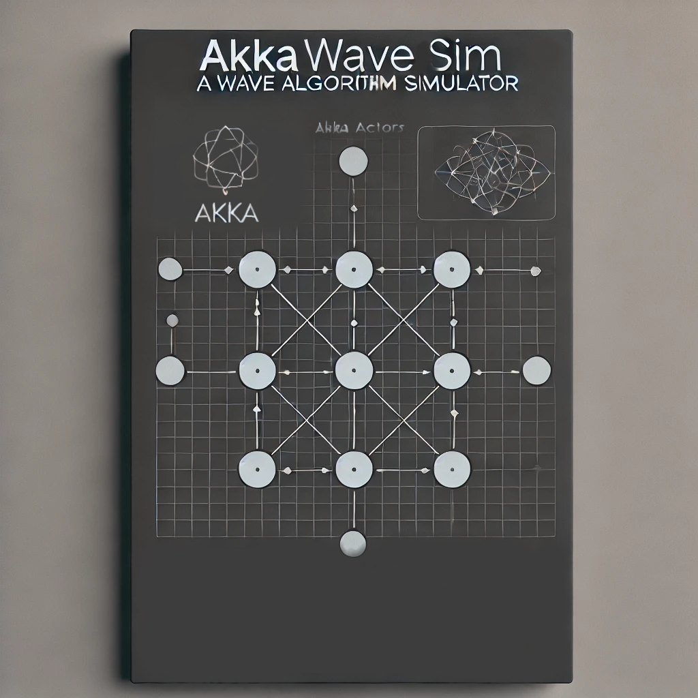

---

# AkkaWaveSim
A versatile simulator for distributed [wave algorithms](https://www.geeksforgeeks.org/wave-and-traversal-algorithm-in-distributed-system/) in strongly connected networks

---

## Project Description

<div style="text-align: justify;">

AkkaWaveSim is a powerful tool for simulating various wave algorithms in distributed computing environments. Designed for strongly connected networks, it implements a range of algorithms including Tarry's, DFS-Wave, Optimized-DFS Wave, Awerbuch's, Cidon's, Tree, and Echo Wave Algorithms. Utilizing the Akka Typed framework and the Actor model, AkkaWaveSim facilitates decentralized, message-driven simulations, providing an insightful exploration into distributed systems.



</div>

---

## Key Features

- <ins>**Distributed Network Simulation**</ins>: Leverage Akka (Scala) to create robust simulations of distributed networks.
- <ins>**Akka Typed with Scala 3**</ins>: A beginner-friendly guide to using Akka-typed with Scala 3.
- <ins>**Wave Algorithms Implementation**</ins>: Implement and simulate renowned distributed wave algorithms including Tarry's, DFS-Wave, Optimized-DFS Wave, Awerbuch's, Cidon's, Tree, and Echo Wave Algorithms.
- <ins>**Actor Model**</ins>: Utilize the Actor model for efficient, message-driven computation.
- <ins>**Strongly Connected Networks**</ins>: Focus on simulations within strongly connected network topologies.
- <ins>**Educational Resource**</ins>: Ideal for students and professionals looking to understand distributed systems and wave algorithms.
- <ins>**Scalable and Extensible**</ins>: Designed for scalability and easy extension to incorporate new algorithms and network configurations.

---

## Requirements

To get started with AkkaWaveSim, ensure you have the following software installed on your system:

+ **Java Development Kit (JDK) 11**: Necessary for compiling and running Scala applications.
  - [Download JDK 11](https://www.oracle.com/java/technologies/javase-jdk11-downloads.html)
  - Ensure that the `JAVA_HOME` environment variable is set correctly.

+ **Scala 3.2.2**: The programming language used for this project.
  - [Download Scala](https://www.scala-lang.org/download/)
  - Confirm the installation by running `scala -version` in your terminal.

+ **SBT (Scala Build Tool) 1.8.3**: For building and managing Scala projects.
  - [Download SBT](https://www.scala-sbt.org/download.html)
  - Verify the installation by running `sbt sbtVersion` in your terminal.

> [!NOTE]
> - This project relies on a lightweight JAR file from the [NetGameSim](https://github.com/0x1DOCD00D/NetGameSim) project. Assuming you have the ability to run NetGameSim and generate graph files, this project utilizes a `.ngs` binary file produced by NetGameSim. This file contains the graph information necessary to simulate a distributed network within AkkaWaveSim.
<br>

---

## How to use the project
1. Clone this project
   ```bash
   git clone https://github.com/punit170/AkkaWaveSim.git
   ```   
2. Set the configuration:
   Open the application.conf file located at `src/main/resources/application.conf` and configure the following parameters: 
```md
   - `ngsGraphDir`: Path to the directory where the input `.ngs` Graph binary file exists.
   - `ngsGraphFileName`: File name of the original graph (with `.ngs` extension).
```

3. Compile the project:
   From the terminal, navigate to the project directory and run:
   ```bash
   sbt compile
   ```
4. Run the project:
   Use the following command to start the application:
   ```bash
   sbt run
   ```
5. Interact with the application:
   Once the application is running, it will load the graph data and prompt for user input as follows:

```
Welcome to AkkaWaveSim
Select one from the following to initiate a wave algorithm simulation:
1. Tarry's Algo[1]              2. DFS Algo[2]              3. Optimized DFS Algo[3]        
4. Awerbuch's Algo[4]           5. Cidon's Algo[5]
6. Tree Algo[6]                 7. Echo Algo[7]
Enter choice[1-7]:
```

- You can execute a wave algorithm of your choice by entering a corresponding number between 1 and 7, followed by pressing enter.
- The simulation will then run based on the selected algorithm.
- After the simulation completes, you will be returned to the prompt, allowing you to initiate additional simulations in a continuous loop.
<br>

> [!IMPORTANT]
> All relevant and critical information and message exchanges are logged using Akka's context logger. Log files can be found in the `log` directory.

---

## Need Help?

Reach out to me!
**Email:** [punit.malpani@gmail.com](mailto:punit.malpani@gmail.com)

